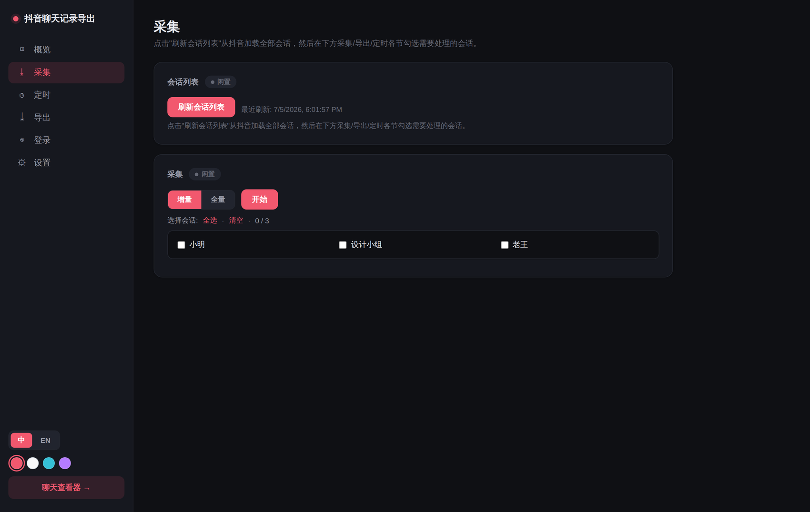

# 抖音聊天记录导出工具

从抖音网页版完整导出私信聊天记录，并提供本地 Web 浏览界面。

## 功能

- **完整导出**：通过直接调用抖音 IM API（protobuf），突破虚拟列表滚动上限，可导出完整历史记录
- **精确排序**：使用服务端 `created_at_us` 单调递增序号排序，确保消息顺序正确
- **多种消息类型**：文本、表情包、图片、语音、分享视频/商品/直播、系统消息等
- **引用/回复消息**：提取引用消息数据，前端显示引用区块并支持点击跳转到原消息
- **语音消息**：自动下载语音文件到本地，前端支持播放
- **增量更新**：支持增量模式，只获取新消息
- **前端浏览器**：内置 Vue 3 + FastAPI 聊天记录浏览界面，支持无限滚动、全文搜索、搜索跳转
- **ChatLab 导出**：支持导出为 [ChatLab](https://github.com/hellodigua/ChatLab) 标准格式（JSON/JSONL），可用于 AI 聊天记录分析
- **控制面板**：Web 管理面板，可视化控制采集、导出、定时任务，支持远程扫码登录
- **Docker 部署**：支持 Docker 一键部署，含前端、后端、采集器

## 部署方式

### 方式一：本地运行

```bash
# 克隆项目
git clone https://github.com/TeamBreakerr/douyin-chat-export.git
cd douyin-chat-export

# 创建虚拟环境
python3 -m venv venv
source venv/bin/activate          # macOS / Linux
# venv\Scripts\activate           # Windows PowerShell

# 安装 Python 依赖
pip install -r requirements.txt
playwright install chromium

# 安装前端依赖并构建
cd frontend
npm install
npm run build
cd ..

# 启动服务
python3 -m uvicorn backend.main:app --host 127.0.0.1 --port 8000
```

访问 `http://localhost:8000` 查看聊天记录，`http://localhost:8000/panel` 打开控制面板。

### 方式二：Docker 部署

```bash
git clone https://github.com/TeamBreakerr/douyin-chat-export.git
cd douyin-chat-export
docker compose up -d --build
```

默认配置已包含前端构建、后端服务、Playwright 浏览器环境。数据持久化在 `./data` 目录。

#### 环境变量

| 变量 | 默认值 | 说明 |
|------|--------|------|
| `MODE` | `all` | `web` 只启动 Web 服务 / `scraper` 只执行采集 / `all` 全部启动 |
| `HEADLESS` | `true` | 浏览器是否无头模式（Docker 中必须为 true） |
| `SCRAPER_INCREMENTAL` | `true` | 采集是否增量模式 |
| `SCRAPER_FILTER` | (空) | 过滤指定会话名称 |
| `SCRAPER_SCHEDULE` | (空) | cron 表达式，如 `0 */6 * * *`（空=不定时） |

#### 反向代理（可选）

`docker-compose.yml` 默认不映射端口，通过 Docker 网络 `web-internal` 与反向代理（如 Nginx Proxy Manager）配合使用。如需直接访问，添加端口映射：

```yaml
services:
  douyin-chat-export:
    ports:
      - "8000:8000"
```

## 使用

### 1. 登录

首次使用需要登录抖音，支持以下方式：

#### 方式 A：本地浏览器扫码（推荐 Docker 用户）

在宿主机运行脚本，弹出真实浏览器窗口扫码，登录态通过 volume 映射自动同步到容器：

```bash
# 需先安装 Playwright：pip install playwright && playwright install chromium
python3 login.py
```

扫码成功后浏览器自动关闭。如检测到 Docker 容器，会自动重启服务使登录生效。

#### 方式 B：Cookie 导入

适合无法在宿主机安装 Playwright 的情况。在任意浏览器中登录抖音后导出 Cookie：

1. 打开 `douyin.com` 并登录
2. 按 `F12` → **Application** → **Cookies** → `https://www.douyin.com`
3. 右键 Cookie 表格空白处 → **Copy all cookies**
4. 打开控制面板 `/panel`，点击 **导入 Cookie**，粘贴后点导入

支持 JSON 数组格式（DevTools Copy all cookies）和 `key=value; key=value` 字符串格式（`document.cookie`）。

#### 方式 C：控制面板远程扫码

打开控制面板 `/panel`，点击"扫码登录"，通过截图远程操作容器内的浏览器。适合临时使用，但延迟较高。

登录状态保存在 `data/browser_profile/`，通过 volume 挂载持久化。

### 2. 导出聊天记录

```bash
# 全量导出所有会话
python3 extract.py

# 只导出指定会话
python3 extract.py --filter "会话名称"

# 增量更新（只获取新消息）
python3 extract.py --filter "会话名称" --incremental
```

也可在控制面板 `/panel` 中可视化操作。

### 3. 导出为 ChatLab 格式

支持导出为 [ChatLab](https://github.com/hellodigua/ChatLab) 标准格式，可直接导入 ChatLab 进行 AI 分析。

```bash
# 导出为 JSONL（默认）
python3 export.py --filter "会话名称"

# 导出为 JSON
python3 export.py --filter "会话名称" --format json

# 指定输出路径
python3 export.py --filter "会话名称" --output data/export.jsonl
```

导出内容包括：文本、表情、图片 URL、语音（base64 嵌入）、分享链接、引用/回复关系。

### 4. 控制面板

访问 `/panel` 可使用 Web 控制面板：

- **状态概览**：会话数、消息数、用户数
- **登录管理**：远程扫码登录、检查登录状态、清除会话
- **采集控制**：增量/全量切换、会话过滤（支持自定义输入）、实时日志
- **定时任务**：标准 cron 表达式、预设快捷按钮
- **导出管理**：选择格式和会话、一键导出下载
- **密码保护**：为聊天记录浏览界面和控制面板设置访问密码
- **主题切换**：Dark / Light / Ocean / Purple 四种主题



## 注意事项

- 本工具仅用于导出**自己的**聊天记录备份，请勿用于非法用途
- 抖音可能随时更改 API 接口，导致工具失效
- 媒体 CDN URL 有签名有效期（约 1 年），过期后图片/表情包将无法显示
- 语音文件会下载到本地 `data/media/`，不受 CDN 过期影响

## License

MIT
