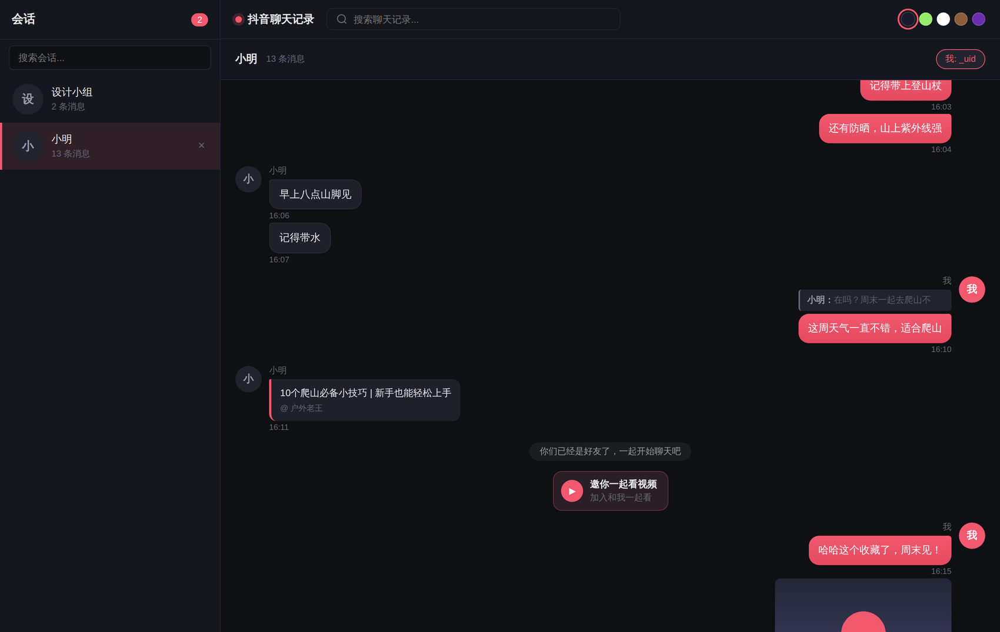

<div align="center">

# 抖音聊天记录导出工具

**从抖音网页版完整导出私信聊天记录，本地 Web 界面浏览、搜索、导出。**

直接调用抖音 IM 接口（protobuf）抓取，突破网页虚拟列表的滚动上限，可导出完整历史。

</div>

<div align="center">
  
</div>

> **目录** ·
> [功能](#功能) ·
> [快速开始](#快速开始) ·
> [部署](#部署) ·
> [使用](#使用) ·
> [控制面板](#控制面板) ·
> [注意事项](#注意事项)

---

## 功能

**采集**
- **完整历史** — 直接调用抖音 IM API（protobuf），突破虚拟列表滚动上限
- **精确排序** — 用服务端 `created_at_us` 单调递增序号排序，消息顺序不乱
- **增量更新** — 增量模式只抓新消息
- **多种消息类型** — 文本、表情包、图片、语音、视频、分享（视频/商品/直播）、一起看视频、引用回复、系统消息

**浏览**（Vue 3 + FastAPI 内置界面）
- 无限滚动、全文搜索、搜索结果一键跳转到原消息
- 消息分组、引用回复区块、图片点击放大、语音/视频在线播放
- 5 套主题一键切换（暗色 / 微信绿 / 浅色 / 暖棕 / 紫夜），全中文界面

**媒体本地化**
- 图片 AES-GCM 解密 + HEIC 自动转 JPEG；语音自动落地；视频 MPEG-CENC 解密 + faststart 转封装
- 可开关「新消息自动下载」与「回填历史媒体」，避免抖音 CDN 链接过期后失效

**导出 & 运维**
- 导出 [ChatLab](https://github.com/hellodigua/ChatLab) 标准格式（JSON / JSONL），可直接做 AI 聊天分析
- Web 控制面板：可视化采集 / 导出 / 定时任务 / 远程扫码登录 / 密码保护
- 定时任务（cron）+ [Server酱](https://sct.ftqq.com) 失败推送到微信
- Docker 一键部署，数据持久化到 `./data`

## 快速开始

已装 Docker，三条命令跑起来：

```bash
git clone https://github.com/TeamBreakerr/douyin-chat-export.git
cd douyin-chat-export
docker compose up -d --build
```

然后 `python3 login.py` 在宿主机扫码登录（见[登录](#1-登录)），再到 `/panel` 采集即可。
访问 `http://localhost:8000` 浏览，`http://localhost:8000/panel` 打开控制面板。

## 环境要求

| 依赖 | 版本 | 说明 |
|------|------|------|
| Docker | >= 20.10 | **推荐**，容器内已含全部依赖 |
| Python | >= 3.10 | 本地运行时的后端与采集器 |
| Node.js | >= 20.19 或 >= 22.12 | 本地运行时构建前端（Vite 7 要求） |

> Docker 用户无需手动装 Python / Node.js，直接看 [Docker 部署](#docker-部署推荐)。

## 部署

### Docker 部署（推荐）

```bash
git clone https://github.com/TeamBreakerr/douyin-chat-export.git
cd douyin-chat-export
docker compose up -d --build
```

已包含前端构建、后端服务、Playwright 浏览器环境。数据持久化在 `./data`。

<details>
<summary><b>环境变量</b></summary>

| 变量 | 默认值 | 说明 |
|------|--------|------|
| `MODE` | `all` | `web` 只启动 Web / `scraper` 只采集 / `all` 全部 |
| `HEADLESS` | `true` | 浏览器无头模式（Docker 中必须为 `true`） |
| `SCRAPER_INCREMENTAL` | `true` | 采集是否增量 |
| `SCRAPER_FILTER` | (空) | 过滤指定会话名称 |
| `SCRAPER_SCHEDULE` | (空) | cron 表达式，如 `0 */6 * * *`（空=不定时） |

</details>

<details>
<summary><b>反向代理</b></summary>

`docker-compose.yml` 默认不映射端口，通过 Docker 网络 `web-internal` 配合反向代理（如 Nginx Proxy Manager）。如需直接访问，加端口映射：

```yaml
services:
  douyin-chat-export:
    ports:
      - "8000:8000"
```

</details>

### 本地运行

```bash
git clone https://github.com/TeamBreakerr/douyin-chat-export.git
cd douyin-chat-export

# Python 环境
python3 -m venv venv
source venv/bin/activate          # Windows: venv\Scripts\activate
pip install -r requirements.txt
playwright install chromium

# 构建前端（Node.js >= 20.19 或 >= 22.12）
cd frontend && npm install && npm run build && cd ..

# 启动
python3 -m uvicorn backend.main:app --host 127.0.0.1 --port 8000
```

浏览 `http://localhost:8000`，控制面板 `http://localhost:8000/panel`。

<details>
<summary>Node.js 版本不对？</summary>

Vite 7 要求 Node.js **20.19+** 或 **22.12+**，推荐用 [nvm](https://github.com/nvm-sh/nvm) 管理：

```bash
curl -o- https://raw.githubusercontent.com/nvm-sh/nvm/v0.40.3/install.sh | bash
nvm install 22 && nvm use 22
node -v   # 确认 >= 22.12
```

Windows 用户可用 [nvm-windows](https://github.com/coreybutler/nvm-windows) 或从 [Node.js 官网](https://nodejs.org/) 下载 LTS。
</details>

## 使用

### 1. 登录

首次使用需登录抖音，三选一：

<details open>
<summary><b>方式 A：本地浏览器扫码</b>（推荐 Docker 用户）</summary>

在宿主机运行，弹出真实浏览器窗口扫码，登录态经 volume 自动同步到容器：

```bash
# 需先装 Playwright：pip install playwright && playwright install chromium
python3 login.py
```

扫码成功后浏览器自动关闭；检测到容器会自动重启使登录生效。
</details>

<details>
<summary><b>方式 B：Cookie 导入</b>（无法在宿主机装 Playwright 时）</summary>

在任意浏览器登录抖音后导出 Cookie：

1. 打开 `douyin.com` 并登录
2. `F12` → **Application** → **Cookies** → `https://www.douyin.com`
3. 右键 Cookie 表格空白处 → **Copy all cookies**
4. 控制面板 `/panel` → **登录** → **导入 Cookie**，粘贴导入

支持 JSON 数组（DevTools Copy all cookies）和 `key=value; key=value` 字符串（`document.cookie`）两种格式。
</details>

<details>
<summary><b>方式 C：控制面板远程扫码</b></summary>

`/panel` → **登录** → **扫码登录**，通过截图远程操作容器内浏览器。适合临时使用，延迟较高。
</details>

登录态保存在 `data/browser_profile/`，经 volume 持久化。

### 2. 采集

在控制面板 **采集** 分区可视化操作（增量/全量切换、勾选会话、实时日志），或用命令行：

```bash
python3 extract.py                          # 全量采集所有会话
python3 extract.py --filter "会话名称"        # 只采集指定会话
python3 extract.py --filter "会话名称" --incremental   # 增量（只取新消息）
```

### 3. 导出为 ChatLab 格式

导出 [ChatLab](https://github.com/hellodigua/ChatLab) 标准格式，可直接导入做 AI 分析：

```bash
python3 export.py --filter "会话名称"                    # JSONL（默认）
python3 export.py --filter "会话名称" --format json      # JSON
python3 export.py --filter "会话名称" --output data/export.jsonl
```

导出内容：文本、表情、图片 URL、语音（base64 嵌入）、分享链接、引用/回复关系。也可在控制面板 **导出** 分区一键操作。

## 控制面板

访问 `/panel`，侧栏分区管理全部功能：

<div align="center">
  
</div>

| 分区 | 功能 |
|------|------|
| **概览** | 会话数 / 消息数 / 用户数 |
| **采集** | 刷新会话列表、增量/全量切换、勾选会话、实时日志 |
| **定时** | 标准 cron 表达式 + 预设快捷按钮 |
| **导出** | 选格式和会话一键导出下载、媒体回填（历史图片/视频） |
| **登录** | 远程扫码、Cookie 导入、检查/清除登录态 |
| **设置** | 访问密码、Server酱 失败通知；4 套主题、中英文切换 |

<details>
<summary><b>配置失败通知（Server酱）</b></summary>

适合开了定时任务的用户：cookie 失效、抖音接口变动导致采集失败时主动推送，免去定时查面板。

1. 到 [sct.ftqq.com](https://sct.ftqq.com) 用微信登录，复制 SendKey（形如 `SCT...`）
2. 控制面板 → **设置** → 通知 → 粘贴 SendKey → **设置**
3. 点 **测试** 验证微信能收到

后续每次采集失败（含定时任务）自动推送：

```
抖音聊天导出 · 采集失败
失败时间: 2026-05-26 18:42:11
原因: 采集失败 (exit code 2)
日志末尾:
  [+] 浏览器已启动
  [*] 等待扫码登录...
  [-] 未能登录，退出
```

</details>

## 注意事项

- 本工具仅用于导出**自己的**聊天记录备份，请勿用于非法用途
- 抖音可能随时更改接口导致工具失效
- 媒体 CDN URL 有签名有效期（约 1 年），过期后未本地化的图片/表情将无法显示
- 语音文件自动下载到 `data/media/voice/`，不受 CDN 过期影响
- 控制面板可开启「图片本地下载」，将图片和表情包持久化到 `data/media/`

## License

MIT
